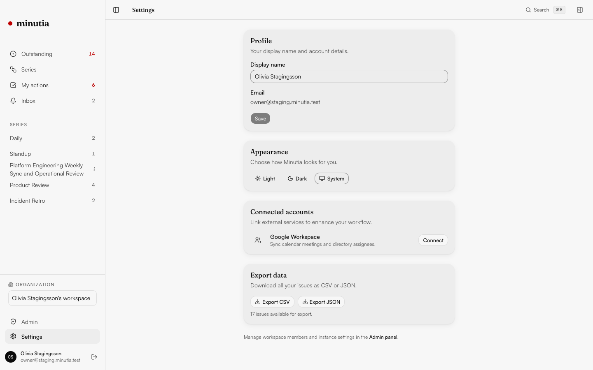

# Minutia

**Stop losing track of what was said, decided, and owed in your meetings.**

[](LICENSE)
[](https://github.com/shiprite-dev/minutia/actions/workflows/ci.yml)


---

## The Problem

Every recurring meeting (vendor syncs, steering committees, project standups, 1:1s) generates action items, decisions, and follow-ups. These end up in spreadsheets that nobody updates, email chains that get buried, or Notion databases that break when someone edits a relation.

You spend 30 minutes before every sync rebuilding the same agenda from memory. Issues slip through. People forget what they owe. The spreadsheet rots.

## The Fix

Minutia is a purpose-built **Outstanding Issues Log (OIL)** for recurring meetings. Issues persist across meetings. Status is tracked with accountability. You walk into every meeting knowing exactly what's pending, who owes what, and since when.

- **Free and open source** (AGPL-3.0). Self-host it on your own infrastructure, forever.
- **AI-optional, human-first.** Works without any AI, recording, or calendar integration. Turn on AI features when you're ready.
- **Built for mixed teams.** Tech leads, vendors, coordinators, non-technical stakeholders. Anyone can use it in 10 seconds via a share link, no account needed.

## What You Get

### OIL Board

Your outstanding issues dashboard. Filter, sort, group by series/owner/priority. Keyboard-navigable (J/K to move, S to cycle status, N to add).


### Meeting Series & Pre-Meeting Briefs

Recurring meetings with cadence, attendees, and automatic pre-meeting briefs. See what's pending before your meeting, send a one-click summary to attendees.


### Meeting Complete & Inline Tasks

After a meeting ends, see a summary of raised items, decisions, and carried-forward issues. Items render as interactive checklists with colored category pills (Action, Blocker, Decision, Info, Risk) and assignee avatars.


### AI Meeting Notes & Auto Action Items (opt-in)

Record meeting audio in the browser; Minutia transcribes it and extracts accountable action items for you to review. Unlike a one-off summarizer, the extraction reasons over the **entire series history**: it deduplicates against open OIL items, flags when a meeting resolves or advances an existing item (a status update straight onto the board), and warns about duplicates, so your log stays clean. Nothing enters the permanent record until a facilitator approves it. Bring your own AI key; everything else works without it.

### Issue Lifecycle

Every issue has a full timeline: when it was raised, every status change, every update, across every meeting it was discussed in.


### My Actions

See everything you owe across all your meeting series, prioritized by urgency.


### Settings & Integrations

Connect Google Calendar for read-only calendar sync, manage your profile, choose light/dark/system theme, and export all your data as CSV or JSON.



### And more

- **Live Capture** - Raise issues in real-time with type prefixes (`a ` for action, `d ` for decision, `r ` for risk). Carried items from last meeting pre-populated. Works offline with auto-sync.
- **Calendar Sidebar** - Persistent mini-calendar panel (Ctrl+.), month navigation, day agenda with meeting links, scroll-to-date integration on series timeline.
- **Google Sign-In** - One-click OAuth login alongside email/password and guest auth.
- **Guest Sharing** - Share read-only links with external collaborators. No account required.
- **Single-Workspace Team Access** - Self-hosted instances use one workspace with admin-managed invitations for teammates.
- **One-Click Reminders** - Nudge issue owners about their open items between meetings, via email, Slack, webhook, or a copy-paste digest.
- **Admin / Instance Panel** - Operator console for self-hosted instances: overview metrics, runtime config (SMTP, feature flags, AI keys), user management, and service-health checks.
- **Command Palette** - Cmd+K to search across all issues and series instantly.
- **CSV Import/Export** - Migrate from your spreadsheet in seconds. Export anytime.
- **Draggable Widgets** - Drag-to-reorder and resize dashboard widgets. Layout persists via localStorage.
- **Dark Mode** - Both modes are first-class, not afterthoughts.
- **Self-hostable** - One-command Docker Compose deployment.

## Get Started in 60 Seconds

### Self-Hosted (free forever)

```bash
git clone https://github.com/shiprite-dev/minutia.git
cd minutia
pnpm deploy:env
docker compose up -d
```

Open [http://localhost:3000/setup](http://localhost:3000/setup). Enter the `MINUTIA_SETUP_TOKEN` written to `.env`, create the first admin account, optionally seed demo data, then sign in.

For a real domain, generate env with explicit public URLs: `pnpm deploy:env -- --site-url https://minutia.example.com --api-url https://api.example.com`.

Self-hosted Minutia uses one workspace per instance. The first admin manages that workspace and invites additional users from Settings. Public signup is disabled by default; if you explicitly enable it, new users join the existing workspace as members.

### Development

```bash
git clone https://github.com/shiprite-dev/minutia.git
cd minutia
pnpm install
cp .env.example .env.local

# Start local Supabase (requires Docker)
npx supabase start

# Start dev server
pnpm dev
```

For local development, visit `/setup` first when `instance_config.setup_completed` is false. In production, setup is protected by `MINUTIA_SETUP_TOKEN`.

### Onboarding

Minutia has two onboarding layers:

- **Instance setup** is one-time. `/setup` checks environment health, creates the first admin, saves optional instance settings, optionally seeds demo data, and stores completion in `instance_config.setup_completed`.
- **User onboarding** is per user. Any signed-in user with `profiles.has_completed_onboarding = false` sees the three-step onboarding wizard: confirm display name, optionally create a first meeting series, then review a quick product tour. Completing or skipping it updates only that user's profile.

The current tour is a lightweight checklist inside onboarding, not a persistent guided overlay. Keyboard shortcuts remain available from `?` after onboarding.

## Who Is This For?

- **Project coordinators** running vendor syncs, steering committees, ops/eng standups
- **Tech leads** tracking cross-team action items across recurring meetings
- **Anyone** who currently uses a spreadsheet to track meeting follow-ups and is tired of it rotting

**Not for**: engineering teams that live in Jira/Linear (you already have sprint tracking), board-level governance with regulatory requirements (use BoardPro/Diligent), or teams that want AI to replace human note-taking entirely.

## How It Compares

| | Minutia | Fellow | Notion | Excel/Sheets |
|---|---------|--------|--------|-------------|
| Purpose-built OIL | Yes | Feature inside meeting tool | DIY database | Manual rows |
| Open source | AGPL-3.0 | No | No | N/A |
| Self-hostable | Yes | No | No | N/A |
| AI required | No (opt-in) | Yes (core dependency) | No | No |
| Calendar required | No | Yes | No | No |
| Cross-meeting continuity | Core feature | Carry-forward | Manual linking | Manual copy-paste |
| Price | Free (self-host) | $7-25/seat/mo | Free-$10/seat | Free |

## AI (opt-in)

Minutia works with zero AI, recording, or calendar; the data model is AI-ready and every AI feature is opt-in.

- **Meeting transcription** - browser audio capture, auto-transcribed with Whisper (via Groq or any OpenAI-compatible provider).
- **Context-aware action items** - extraction that reasons over the full series history to deduplicate, detect resolutions, and flag duplicates, rather than summarizing one meeting in isolation.
- **Note enhancement and carryover briefings** - clean up freeform notes and surface what carries into the next meeting.

Self-hosters bring their own key: set `OPENROUTER_API_KEY` (or an OpenAI-compatible key) in your environment to enable AI, or leave it unset to run fully AI-free.

## Roadmap

### Planned
- Scheduled email digests and pre-meeting nudges (Resend + SMTP)
- `/api/v1/ingest` REST endpoint for transcript ingestion
- Drag-to-reorder issue priority
- PDF export
- Enterprise SSO (SAML / OIDC)

---

## Keyboard Shortcuts

| Key | Action |
|-----|--------|
| `N` | New issue (quick add) |
| `J` / `K` | Navigate issues on OIL Board |
| `S` | Cycle issue status |
| `C` | Add update/comment |
| `Cmd+K` | Command palette |
| `Ctrl+.` | Toggle calendar sidebar |
| `?` | Show all shortcuts |

---

## Technical Details

### Stack

| Layer | Technology |
|-------|-----------|
| Framework | Next.js 16 (App Router, React 19, Turbopack) |
| Styling | Tailwind CSS v4 + OKLCH color system |
| Components | shadcn/ui (Radix primitives) |
| Database | Postgres via Supabase (RLS on every table) |
| Auth | Supabase Auth (email/password, Google OAuth) |
| State | TanStack React Query + Zustand |
| Animation | Motion v12 |
| Testing | Playwright (120+ E2E tests) |

### Project Structure

```
src/
  app/(app)/        Authenticated routes (OIL Board, Series, Issues, Settings)
  app/(auth)/       Login page
  app/share/        Public guest share pages (no auth)
  components/       UI primitives (shadcn) + app components (minutia/)
  lib/              Hooks, stores, types, schemas, offline buffer
supabase/
  migrations/       Numbered SQL migrations
e2e/
  regression/       Playwright test specs
docker-compose.yml  One-command self-hosting
```

### Commands

| Command | Description |
|---------|-------------|
| `pnpm dev` | Start dev server (localhost:3000) |
| `pnpm build` | Production build |
| `pnpm lint` | ESLint |
| `pnpm test:e2e` | Run Playwright E2E tests |
| `pnpm test:e2e:ui` | Playwright UI mode |

## Contributing

See [CONTRIBUTING.md](CONTRIBUTING.md) for development setup, coding standards, and PR process.

## Security

See [SECURITY.md](SECURITY.md) for vulnerability reporting.

## License

[AGPL-3.0](LICENSE). Self-host free forever. Your data is yours.

---

Built by [ShipRite](https://shiprite.dev). Star the repo if Minutia replaces your meeting spreadsheet.
