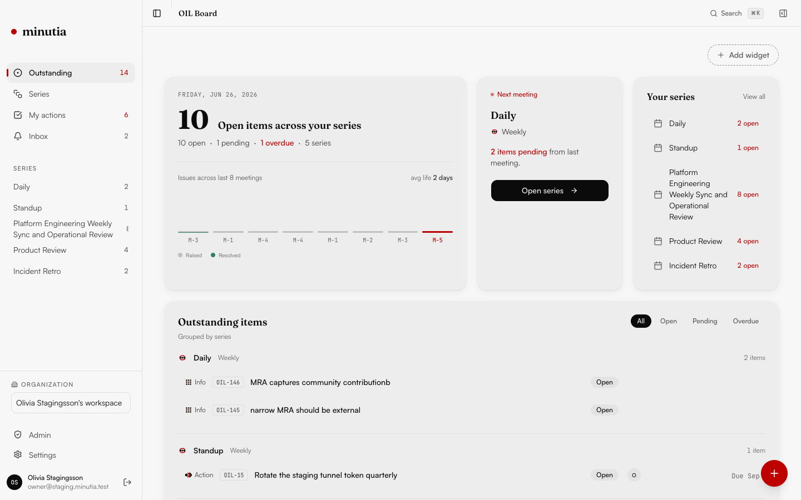
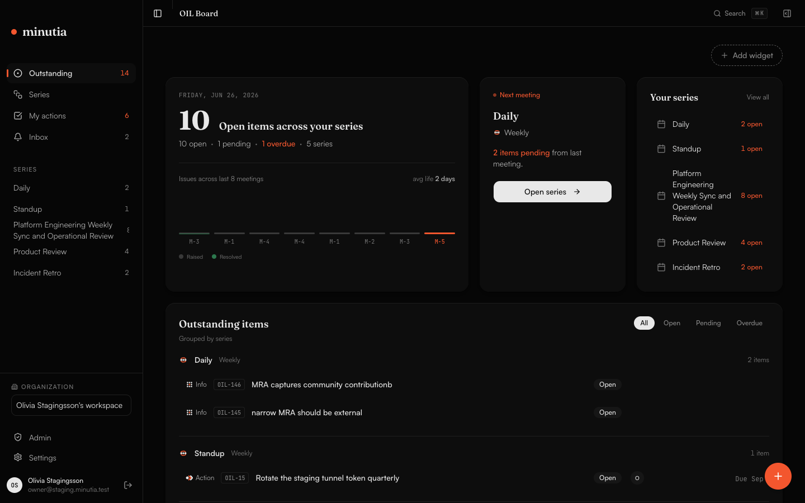
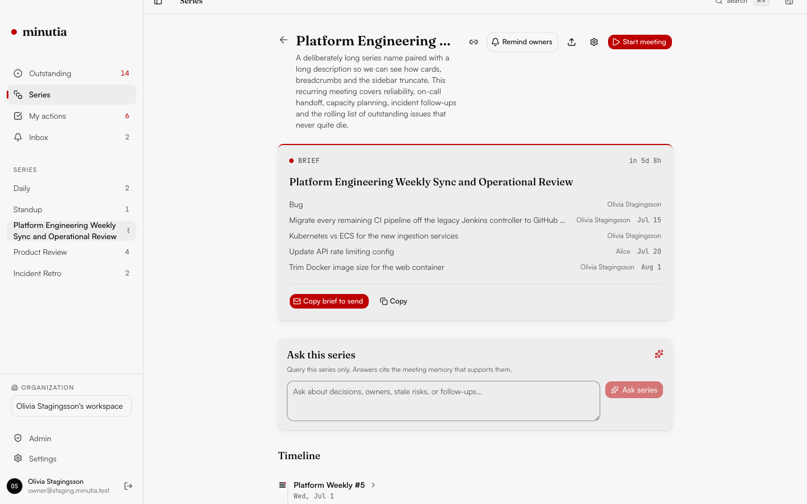
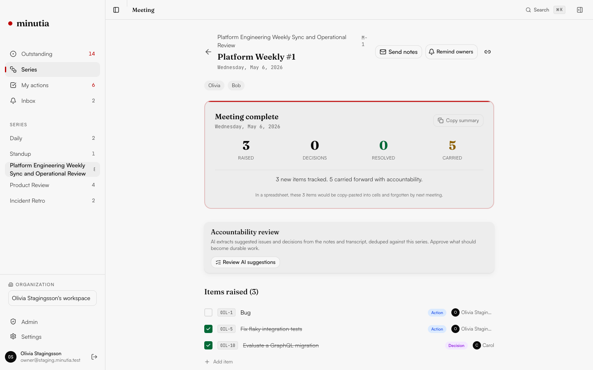
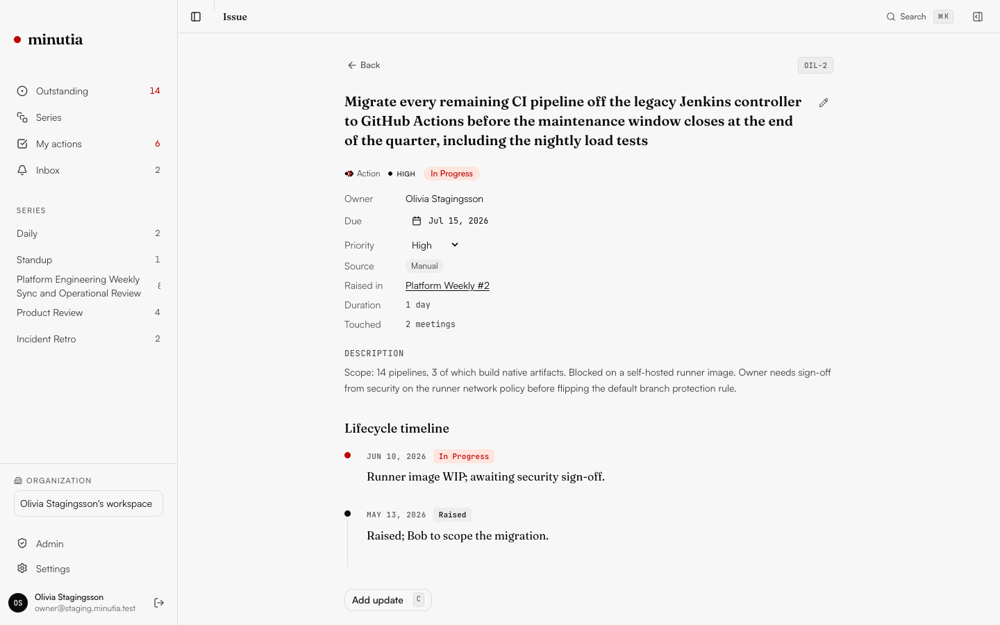
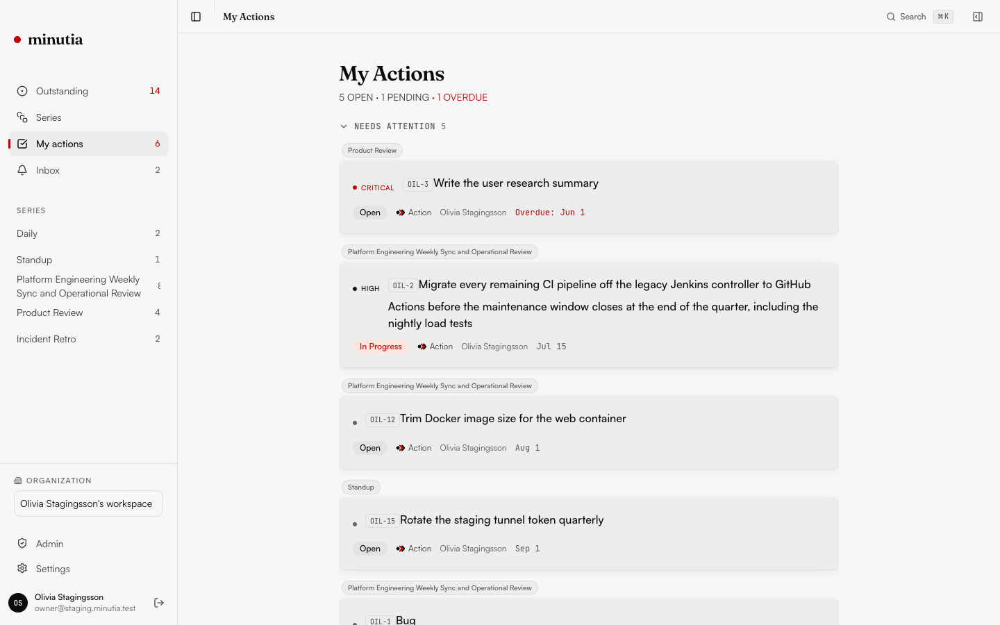

# Minutia

**Stop losing track of what was said, decided, and owed in your meetings.**

[](LICENSE)
[](https://github.com/shiprite-dev/minutia/actions/workflows/ci.yml)



---

## The Problem

Every recurring meeting (vendor syncs, steering committees, project standups, 1:1s) generates action items, decisions, and follow-ups. These end up in spreadsheets that nobody updates, email chains that get buried, or Notion databases that break when someone edits a relation.

You spend 30 minutes before every sync rebuilding the same agenda from memory. Issues slip through. People forget what they owe. The spreadsheet rots.

## The Fix

Minutia is a purpose-built **Outstanding Issues Log (OIL)** for recurring meetings. Issues persist across meetings. Status is tracked with accountability. You walk into every meeting knowing exactly what's pending, who owes what, and since when.

- **Free and open source** (AGPL-3.0). Self-host it on your own infrastructure, forever.
- **AI-optional, human-first.** Works without any AI, recording, or calendar integration. Turn on AI features when you're ready.
- **Built for mixed teams.** Tech leads, vendors, coordinators, non-technical stakeholders. Anyone can use it in 10 seconds via a share link, no account needed.

## What You Get

### OIL Board

Your outstanding issues dashboard. Filter, sort, group by series/owner/priority. Keyboard-navigable (J/K to move, S to cycle status, N to add).



### Meeting Series & Pre-Meeting Briefs

Recurring meetings with cadence, attendees, and automatic pre-meeting briefs. See what's pending before your meeting, send a one-click summary to attendees.



### Live Capture

Raise issues during meetings in real-time. Type `a ` for action, `d ` for decision, `i ` for info, `r ` for risk. Carried items from the last meeting are pre-populated. Works offline with auto-sync.



### Issue Lifecycle

Every issue has a full timeline: when it was raised, every status change, every update, across every meeting it was discussed in.



### My Actions

See everything you owe across all your meeting series, prioritized by urgency.



### Calendar Sidebar & Timeline

A persistent calendar panel (desktop inline, mobile bottom sheet) with mini-calendar, month navigation, and day agenda showing all meetings. Click any date to scroll the series timeline to that point. Toggle with Ctrl+. or the header button.

Series detail pages feature a date-anchored timeline with expandable meeting sections, status icons (completed/live/upcoming), a Today divider, and inline issue and decision previews.

### Inline Tasks

Meeting items render as interactive checklist items with checkbox status toggles, inline title editing, colored category pills, and @mention assignee selection from attendees. Add new items inline with Enter. The meeting detail page becomes an active workspace, not a passive record.

### Draggable Widgets

The OIL Board dashboard is fully customizable. Drag widgets to reorder, resize between narrow and wide layouts, add or remove from a widget picker, and reset to defaults. Your layout persists across sessions via localStorage.

### And more

- **Google Sign-In** - One-click OAuth login alongside magic link and guest auth.
- **Guest Sharing** - Share read-only links with external collaborators. No account required.
- **Command Palette** - Cmd+K to search across all issues and series instantly.
- **CSV Import/Export** - Migrate from your spreadsheet in seconds. Export anytime.
- **Dark Mode** - Both modes are first-class, not afterthoughts.
- **Self-hostable** - One-command Docker Compose deployment.

## Get Started in 60 Seconds

### Self-Hosted (free forever)

```bash
git clone https://github.com/shiprite-dev/minutia.git
cd minutia
cp .env.example .env
# Edit .env: generate JWT_SECRET and API keys (instructions in the file)
docker compose up
```

Open [http://localhost:3000](http://localhost:3000). Create an account. Start tracking.

### Development

```bash
git clone https://github.com/shiprite-dev/minutia.git
cd minutia
pnpm install
cp .env.example .env.local

# Start local Supabase (requires Docker)
npx supabase start

# Start dev server
pnpm dev
```

## Who Is This For?

- **Project coordinators** running vendor syncs, steering committees, ops/eng standups
- **Tech leads** tracking cross-team action items across recurring meetings
- **Anyone** who currently uses a spreadsheet to track meeting follow-ups and is tired of it rotting

**Not for**: engineering teams that live in Jira/Linear (you already have sprint tracking), board-level governance with regulatory requirements (use BoardPro/Diligent), or teams that want AI to replace human note-taking entirely.

## How It Compares

| | Minutia | Fellow | Notion | Excel/Sheets |
|---|---------|--------|--------|-------------|
| Purpose-built OIL | Yes | Feature inside meeting tool | DIY database | Manual rows |
| Open source | AGPL-3.0 | No | No | N/A |
| Self-hostable | Yes | No | No | N/A |
| AI required | No (opt-in) | Yes (core dependency) | No | No |
| Calendar required | No | Yes | No | No |
| Cross-meeting continuity | Core feature | Carry-forward | Manual linking | Manual copy-paste |
| Price | Free (self-host) / $5/mo (Cloud) | $7-25/seat/mo | Free-$10/seat | Free |

## AI Strategy

Minutia is AI-optional. The data model is AI-ready from day one, but AI features are opt-in per meeting series.

- **Now**: Manual capture with AI-ready architecture
- **Next**: Auto-classify items, smart pre-meeting briefs, transcript ingestion
- **Later**: Native audio capture, local transcription, cross-meeting intelligence

Self-hosters bring their own API key (Claude, OpenAI, Ollama). Cloud users get AI included.

## Roadmap

### In Progress
- Onboarding flow for first-time users
- Email digests and pre-meeting nudges (Resend + SMTP)

### Planned
- `/api/v1/ingest` REST endpoint for transcript ingestion
- AI auto-classification and smart pre-meeting briefs
- Real-time collaboration (Supabase Realtime subscriptions)
- Team/org management (multi-user beyond single profile)
- Drag-to-reorder issue priority
- PDF export
- Landing page and marketing site

---

## Keyboard Shortcuts

| Key | Action |
|-----|--------|
| `N` | New issue (quick add) |
| `J` / `K` | Navigate issues on OIL Board |
| `S` | Cycle issue status |
| `C` | Add update/comment |
| `Cmd+K` | Command palette |
| `Ctrl+.` | Toggle calendar sidebar |
| `?` | Show all shortcuts |

---

## Technical Details

### Stack

| Layer | Technology |
|-------|-----------|
| Framework | Next.js 16 (App Router, React 19, Turbopack) |
| Styling | Tailwind CSS v4 + OKLCH color system |
| Components | shadcn/ui (Radix primitives) |
| Database | Postgres via Supabase (RLS on every table) |
| Auth | Supabase Auth (email/password, Google OAuth) |
| State | TanStack React Query + Zustand |
| Animation | Motion v12 |
| Testing | Playwright (120+ E2E tests) |

### Project Structure

```
src/
  app/(app)/        Authenticated routes (OIL Board, Series, Issues, Settings)
  app/(auth)/       Login page
  app/share/        Public guest share pages (no auth)
  components/       UI primitives (shadcn) + app components (minutia/)
  lib/              Hooks, stores, types, schemas, offline buffer
supabase/
  migrations/       Numbered SQL migrations
e2e/
  regression/       Playwright test specs
docker-compose.yml  One-command self-hosting
```

### Commands

| Command | Description |
|---------|-------------|
| `pnpm dev` | Start dev server (localhost:3000) |
| `pnpm build` | Production build |
| `pnpm lint` | ESLint |
| `pnpm test:e2e` | Run Playwright E2E tests |
| `pnpm test:e2e:ui` | Playwright UI mode |

## Contributing

See [CONTRIBUTING.md](CONTRIBUTING.md) for development setup, coding standards, and PR process.

## Security

See [SECURITY.md](SECURITY.md) for vulnerability reporting.

## License

[AGPL-3.0](LICENSE). Self-host free forever. Your data is yours.

---

Built by [ShipRite](https://shiprite.dev). Star the repo if Minutia replaces your meeting spreadsheet.
